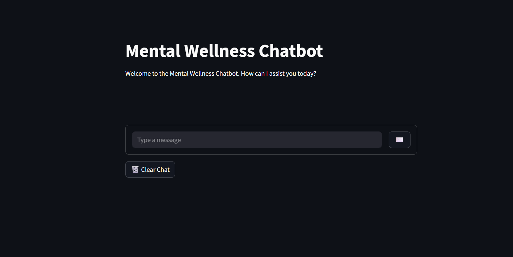

# Mental Wellness Chatbot

## Project Overview
The **Mental Wellness Chatbot** is an AI-powered conversational assistant designed to promote mental well-being. It leverages advanced sentiment and emotion analysis to understand user inputs and generate empathetic, supportive responses. The chatbot also visualizes emotional trends and maintains user session logs, helping users track their emotional states over time.

---

## Features

- **Conversational Interface:** Intuitive chat UI for seamless user interaction.
- **Sentiment Analysis:** Detects the sentiment (positive, negative, neutral) of user messages using NLP.
- **Emotion Detection:** Identifies and classifies user emotions for more tailored responses.
- **Emotional Trend Visualization:** Graphs and charts to visualize emotional trends across sessions.
- **User Session Logs:** Securely logs user interactions for review and analysis.
- **Cloud LLM Integration:** Uses hosted large language models (e.g., OpenRouter, Hugging Face) for high-quality responses.
- **Error Handling:** Gracefully manages API/network errors and informs the user.
- **Timestamped Chat:** Each message is timestamped for context.
- **Chat Management:** Clear chat history and download conversation features.

---

## Project Structure

```
mental-wellness-chatbot
├── src
│   ├── chatbot.py            # Main chatbot logic
│   ├── interface
│   │   └── ui.py             # Streamlit user interface
│   ├── analysis
│   │   ├── sentiment.py      # Sentiment analysis functions
│   │   └── emotion.py        # Emotion detection functions
│   ├── visualization
│   │   └── trends.py         # Emotional trends visualization
│   ├── logs
│   │   └── session_log.py    # User session logging
│   └── utils
│       └── helpers.py        # Utility functions
├── requirements.txt          # Project dependencies
├── .env                      # Environment variables (not committed)
└── README.md                 # Project documentation
```

---

## Setup Instructions

1. **Clone the repository:**
   ```sh
   git clone <repository-url>
   ```

2. **Navigate to the project directory:**
   ```sh
   cd mental-wellness-chatbot
   ```

3. **Install the required dependencies:**
   ```sh
   pip install -r requirements.txt
   ```

4. **Set up your environment variables:**
   - Create a `.env` file in the project root:
     ```
     OPENROUTER_API_KEY=your_openrouter_api_key_here
     ```
   - Replace `your_openrouter_api_key_here` with your actual API key from [OpenRouter](https://openrouter.ai/) or your chosen LLM provider.

---

## Running the Chatbot

### **Web Interface (Recommended)**
Launch the Streamlit app:
```sh
streamlit run src/interface/ui.py
```
- This will open a browser window with the chat interface.

### **Console Mode**
Run the chatbot in the terminal:
```sh
python src/chatbot.py
```

---

## Deployment

### **Deploying to Streamlit Cloud**
1. Push your repository to GitHub.
2. Go to [Streamlit Cloud](https://streamlit.io/cloud) and connect your repo.
3. Set your `OPENROUTER_API_KEY` as a secret in the Streamlit Cloud settings.
4. Deploy! Your app will be live and accessible via a shareable link.

### **Deploying on Your Own Server**
- Ensure Python and all dependencies are installed.
- Set up your `.env` file with the API key.
- Run `streamlit run src/interface/ui.py` as a background service or with a process manager (e.g., pm2, systemd).

### **Notes**
- **Do NOT commit your `.env` file or API keys to public repositories.**
- For production, consider using HTTPS and securing your deployment.

---

## Screenshot

Below is an example of the chatbot interface:



---

## 🚀 Live Demo


You can try out the app here:  
👉 [Launch the App](https://bank-app-atm.streamlit.app/)

---

## API Integration

This project uses a hosted LLM API (e.g., OpenRouter) for generating responses.  
You can switch to another provider (like Hugging Face Inference Endpoints or Together.ai) by updating the API endpoint and key in `src/llm/response_generator.py`.

---

## Contributing

Contributions are welcome!  
- Open an issue for bug reports or feature requests.
- Submit a pull request for improvements.

---

## License

This project is licensed under the MIT License. See the [LICENSE](LICENSE) file for details.

---

## Acknowledgements

- [Streamlit](https://streamlit.io/)
- [OpenRouter](https://openrouter.ai/)
- [Hugging Face Transformers](https://huggingface.co/transformers/)
- [VADER Sentiment](https://github.com/cjhutto/vaderSentiment)